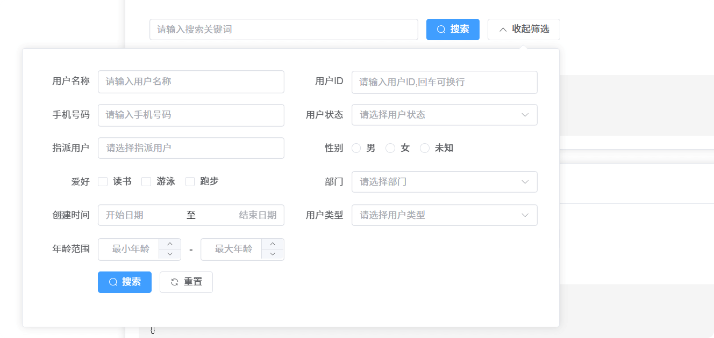
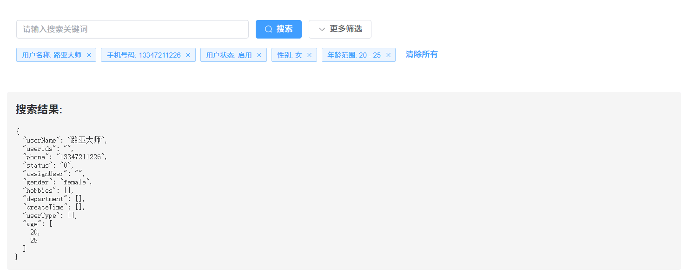

# Element Advanced Search

[](https://www.npmjs.com/package/element-advanced-search)
[](https://vuejs.org/)
[](https://element-plus.org/)
[](https://www.npmjs.com/package/element-advanced-search)
[](https://github.com/wrain/element-advanced-search/stargazers)
[](https://github.com/wrain/element-advanced-search/issues)

[简体中文](README.md) | English

Element Advanced Search is a powerful Vue 3 search component built on Element Plus, providing rich search functionality including quick search, advanced filtering, search condition caching, custom slots, and more. This component and its documentation were developed and written by the Tongyi Lingma intelligent coding assistant, aiming to provide developers with an efficient and easy-to-use search solution. [View feature demo](https://wrain.github.io/element-advanced-search/)

## Component Screenshots

### Basic Search Interface


### Search Results Interface


## Table of Contents

- [Features](#features)
- [Dependencies](#dependencies)
- [Installation and Usage](#installation-and-usage)
- [Type Declaration Usage](#type-declaration-usage)
  - [1. Importing SearchConfig Type](#1-importing-searchconfig-type)
  - [2. Main Type Descriptions](#2-main-type-descriptions)
  - [3. Using Types in Vue Projects](#3-using-types-in-vue-projects)
  - [4. Custom Type Extension](#4-custom-type-extension)
- [Props](#props)
- [Events](#events)
- [SearchConfig Configuration](#searchconfig-configuration)
  - [Basic Configuration](#basic-configuration)
  - [FormItem Configuration](#formitem-configuration)
  - [SelectOption Configuration](#selectoption-configuration)
- [Slots](#slots)
  - [Custom Form Item Slots](#custom-form-item-slots)
  - [Custom Tag Display](#custom-tag-display)
- [Usage Examples](#usage-examples)
  - [Basic Usage](#basic-usage)
  - [With Cache Functionality](#with-cache-functionality)
  - [Remote Search](#remote-search)
- [Complete Feature Demo](#complete-feature-demo)
- [Notes](#notes)
- [Browser Support](#browser-support)
- [License](#license)

## Features

- 🚀 **Quick Search**: Provides simple keyword search functionality
- 🎛️ **Advanced Filtering**: Supports complex filtering conditions with multiple form controls
- 💾 **Search Condition Caching**: Can save search conditions to localStorage
- 🧩 **Custom Slots**: Supports fully customizable form controls
- 🏷️ **Search Tag Display**: Automatically displays current search condition tags
- 📱 **Responsive Layout**: Supports adaptive display for various screen sizes
- 🌐 **Remote Data Support**: Supports remote search and asynchronous data loading

## Dependencies

This component depends on the following libraries:

| Dependency | Version Requirement | Description |
| --- | --- | --- |
| Vue.js | ^3.2.0 | Vue 3 Framework |
| Element Plus | ^2.0.0 | Element Plus UI Component Library |
| Sass/SCSS | ^1.32.0 | Style Preprocessor |

Development Dependencies:
```json
{
  "vue": "^3.2.0",
  "element-plus": "^2.0.0",
  "sass": "^1.32.0"
}
```

Ensure these dependencies are installed in your project:

```bash
# Install runtime dependencies
npm install vue@^3.2.0 element-plus@^2.0.0

# Install development dependencies (if you need to compile Sass)
npm install -D sass@^1.32.0
```

## Installation and Usage

```bash
# Install dependencies
npm install element-plus

# Install component
npm install element-advanced-search
```

```vue
<template>
  <ElementAdvancedSearch
    v-model="searchParams"
    :search-config="searchConfig"
    cache-key="user-search"
    quick-search-field="keywords"
    @search="handleSearch"
  />
</template>

<script setup>
import { ref } from 'vue'
import ElementAdvancedSearch from 'element-advanced-search'
import 'element-advanced-search/dist/style.css'

const searchParams = ref({})
const searchConfig = {
  itemsPerRow: 2,
  popoverWidth: 800,
  labelWidth: '100px',
  inline: true,
  formItems: [
    // Form configuration items
  ]
}

const handleSearch = (params) => {
  console.log('Search parameters:', params)
  // Execute search logic
}
</script>
```

## Type Declaration Usage

This component provides complete TypeScript type support, which you can use as follows:

### 1. Importing SearchConfig Type

```typescript
import type { SearchConfig } from 'element-advanced-search'

// Usage example
const searchConfig: SearchConfig = {
  itemsPerRow: 2,
  popoverWidth: 800,
  labelWidth: '100px',
  inline: true,
  formItems: [
    // Form configuration items
  ]
}
```

### 2. Main Type Descriptions

The main types exported by this component include:

| Type Name | Description |
| --- | --- |
| [SearchConfig](file://e:\web\element-advanced-search\src\components\ElementAdvancedSearch\types.ts#L259-L284) | Search configuration object type, used to define the overall configuration of the search form |
| [FormItem](file://e:\web\element-advanced-search\src\components\ElementAdvancedSearch\types.ts#L246-L257) | Form item configuration type, defines properties of each form item |
| [SelectOption](file://e:\web\element-advanced-search\src\components\ElementAdvancedSearch\types.ts#L57-L61) | Selection option configuration type, used for options in select, radio and other components |

### 3. Using Types in Vue Projects

```vue
<template>
  <ElementAdvancedSearch
    v-model="searchParams"
    :search-config="searchConfig"
    @search="handleSearch"
  />
</template>

<script setup lang="ts">
import { ref } from 'vue'
import ElementAdvancedSearch, { type SearchConfig } from 'element-advanced-search'
import 'element-advanced-search/dist/style.css'

// Define search parameters
const searchParams = ref<Record<string, any>>({})

// Define search configuration and use type declaration
const searchConfig: SearchConfig = {
  itemsPerRow: 2,
  popoverWidth: 800,
  labelWidth: '100px',
  inline: true,
  formItems: [
    {
      field: 'name',
      label: 'Name',
      type: 'input',
      placeholder: 'Please enter name'
    },
    {
      field: 'status',
      label: 'Status',
      type: 'select',
      placeholder: 'Please select status',
      options: [
        { label: 'Enabled', value: '0' },
        { label: 'Disabled', value: '1' }
      ]
    }
  ]
}

// Search event handler function
const handleSearch = (params: Record<string, any>) => {
  console.log('Search parameters:', params)
  // Execute search logic
}
</script>
```

### 4. Custom Type Extension

If you need to extend the types provided by the component, you can use TypeScript's type merging feature:

```typescript
// Extend FormItem type in your project
declare module 'element-advanced-search' {
  interface FormItem {
    // Add custom properties
    customProperty?: string
  }
}
```

Through the above methods, you can make full use of TypeScript's type checking features in your project to improve development efficiency and code quality.

## Props

| Prop Name | Type | Default Value | Description |
| --- | --- | --- | --- |
| searchConfig | SearchConfig | Required | Search configuration object |
| quickSearchField | string | 'keyword' | Quick search field name |
| modelValue | Record<string, any> | {} | v-model bound value |
| cacheKey | string | '' | Cache key name, used to distinguish search conditions for different pages |

## Events

| Event Name | Parameters | Description |
| --- | --- | --- |
| search | (value: Record<string, any>) | Search event, returns search parameters |
| update:modelValue | (value: Record<string, any>) | v-model update event |

## SearchConfig Configuration

### Basic Configuration

| Property Name | Type | Default Value | Description |
| --- | --- | --- | --- |
| itemsPerRow | number | 2 | Number of form items displayed per row |
| popoverWidth | number | 800 | Advanced search popover width |
| labelWidth | string | '100px' | Form item label width |
| inline | boolean | true | Whether to use inline form layout |
| formItems | FormItem[] | [] | Form item configuration array |

### FormItem Configuration

All form items include the following basic properties:

| Property Name | Type | Required | Description |
| --- | --- | --- | --- |
| field | string | Yes | Field name |
| label | string | Yes | Label name |
| type | string | No | Form control type, defaults to 'input' |
| default | any | No | Default value |
| hidden | boolean | No | Whether to hide this form item |

Depending on the type, there are additional specific properties:

#### Input Type (type: 'input')

Text input box

| Property Name | Type | Default Value | Description |
| --- | --- | --- | --- |
| placeholder | string | `Please enter ${label}` | Placeholder text |
| clearable | boolean | true | Whether it can be cleared |

#### Textarea Type (type: 'textarea')

Text area with auto-expansion

| Property Name | Type | Default Value | Description |
| --- | --- | --- | --- |
| shortPlaceholder | string | `Please enter ${label}` | Short placeholder text |
| longPlaceholder | string | `Please enter ${label}` | Detailed placeholder text |
| clearable | boolean | true | Whether it can be cleared |

#### Select Type (type: 'select')

Dropdown selector

| Property Name | Type | Default Value | Description |
| --- | --- | --- | --- |
| placeholder | string | `Please select ${label}` | Placeholder text |
| clearable | boolean | true | Whether it can be cleared |
| multiple | boolean | false | Whether multiple selection is allowed |
| filterable | boolean | false | Whether filtering is allowed |
| remote | boolean | false | Whether remote search is enabled |
| remoteMethod | Function | undefined | Remote search method |
| loadOptions | Function | undefined | Asynchronous option loading method |
| options | SelectOption[] | [] | Option list |

#### Treeselect Type (type: 'treeselect')

Tree selector

| Property Name | Type | Default Value | Description |
| --- | --- | --- | --- |
| placeholder | string | `Please select ${label}` | Placeholder text |
| clearable | boolean | true | Whether it can be cleared |
| multiple | boolean | false | Whether multiple selection is allowed |
| showCheckbox | boolean | false | Whether to show checkboxes |
| maxDropdownHeight | number | 300 | Maximum dropdown height |
| filterable | boolean | false | Whether filtering is allowed |
| nodeKey | string | 'value' | Node key name |
| props | object | { value: 'value', label: 'label', children: 'children' } | Configuration options |
| options | SelectOption[] | [] | Option list |

#### Radio Type (type: 'radio')

Radio buttons

| Property Name | Type | Default Value | Description |
| --- | --- | --- | --- |
| options | SelectOption[] | [] | Option list |

#### Checkbox Type (type: 'checkbox')

Checkboxes

| Property Name | Type | Default Value | Description |
| --- | --- | --- | --- |
| options | SelectOption[] | [] | Option list |

#### Date Type (type: 'date')

Date picker

| Property Name | Type | Default Value | Description |
| --- | --- | --- | --- |
| placeholder | string | `Please select ${label}` | Placeholder text |
| clearable | boolean | true | Whether it can be cleared |

#### Daterange Type (type: 'daterange')

Date range picker

| Property Name | Type | Default Value | Description |
| --- | --- | --- | --- |
| startPlaceholder | string | 'Start date' | Start date placeholder |
| endPlaceholder | string | 'End date' | End date placeholder |
| clearable | boolean | true | Whether it can be cleared |

#### Number Type (type: 'number')

Number input box

| Property Name | Type | Default Value | Description |
| --- | --- | --- | --- |
| min | number | undefined | Minimum value |
| max | number | undefined | Maximum value |
| placeholder | string | `Please enter ${label}` | Placeholder text |
| controlsPosition | string | 'right' | Control button position |

#### Numberrange Type (type: 'numberrange')

Number range input box

| Property Name | Type | Default Value | Description |
| --- | --- | --- | --- |
| min | number | undefined | Minimum value |
| max | number | undefined | Maximum value |
| minPlaceholder | string | 'Minimum value' | Minimum value placeholder |
| maxPlaceholder | string | 'Maximum value' | Maximum value placeholder |
| controlsPosition | string | 'right' | Control button position |

#### Custom Type (type: 'custom')

Custom slot type

| Property Name | Type | Required | Description |
| --- | --- | --- | --- |
| slotName | string | Yes | Slot name |
| displayValue | Function | No | Custom tag display function |

### SelectOption Configuration

| Property Name | Type | Required | Description |
| --- | --- | --- | --- |
| label | string | Yes | Option label |
| value | any | Yes | Option value |
| children | SelectOption[] | No | Child options (for tree structures) |

## Slots

### Custom Form Item Slots

For form items with `type: 'custom'`, you can customize form controls through the specified slot name:

```vue
<template>
  <ElementAdvancedSearch
    v-model="searchParams"
    :search-config="searchConfig"
  >
    <template #status="{ model, field }">
      <el-switch
        v-model="model[field]"
        active-text="Enabled"
        inactive-text="Disabled"
      />
    </template>
  </ElementAdvancedSearch>
</template>
```

Slot scope parameters:
- `model`: Form data object
- [field](file://e:\web\element-advanced-search\src\components\ElementAdvancedSearch\types.ts#L11-L11): Current field name

### Custom Tag Display

For form items with `type: 'custom'`, you can customize the display content of search tags through the [displayValue](file://e:\web\element-advanced-search\src\components\ElementAdvancedSearch\types.ts#L243-L243) function:

```js
const searchConfig = {
  formItems: [
    {
      field: 'status',
      label: 'Status',
      type: 'custom',
      slotName: 'status',
      default: false,
      displayValue: (value) => {
        return value ? 'Enabled' : 'Disabled'
      }
    }
  ]
}
```

## Usage Examples

### Basic Usage

```vue
<template>
  <ElementAdvancedSearch
    v-model="searchParams"
    :search-config="basicSearchConfig"
    @search="handleSearch"
  />
</template>

<script setup>
import { ref } from 'vue'
import ElementAdvancedSearch from 'element-advanced-search'

const searchParams = ref({})

const basicSearchConfig = {
  formItems: [
    {
      field: 'name',
      label: 'Name',
      type: 'input',
      placeholder: 'Please enter name'
    },
    {
      field: 'status',
      label: 'Status',
      type: 'select',
      placeholder: 'Please select status',
      options: [
        { label: 'Enabled', value: '0' },
        { label: 'Disabled', value: '1' }
      ]
    }
  ]
}

const handleSearch = (params) => {
  console.log('Search parameters:', params)
}
</script>
```

### With Cache Functionality

```vue
<template>
  <ElementAdvancedSearch
    v-model="searchParams"
    :search-config="cacheSearchConfig"
    cache-key="user-management"
    quick-search-field="keywords"
    @search="handleSearch"
  >
    <template #status="{ model, field }">
      <el-switch
        v-model="model[field]"
        active-text="Enabled"
        inactive-text="Disabled"
      />
    </template>
  </ElementAdvancedSearch>
</template>

<script setup>
import { ref } from 'vue'
import ElementAdvancedSearch from 'element-advanced-search'

const searchParams = ref({})

const cacheSearchConfig = {
  itemsPerRow: 2,
  popoverWidth: 800,
  labelWidth: '100px',
  inline: true,
  formItems: [
    {
      field: 'userName',
      label: 'User Name',
      type: 'input',
      placeholder: 'Please enter user name'
    },
    {
      field: 'status',
      label: 'Status',
      type: 'custom',
      slotName: 'status',
      displayValue: (value) => value ? 'Enabled' : 'Disabled'
    }
  ]
}

const handleSearch = (params) => {
  console.log('Search parameters:', params)
}
</script>
```

### Remote Search

```js
const remoteSearchConfig = {
  formItems: [
    {
      field: 'assignUser',
      label: 'Assign User',
      type: 'select',
      placeholder: 'Please select assign user',
      filterable: true,
      remote: true,
      remoteMethod: async (query) => {
        // Simulate API call
        const response = await fetch(`/api/users?keyword=${query}`)
        return response.json()
      },
      loadOptions: async () => {
        // Load default options
        const response = await fetch('/api/users')
        return response.json()
      }
    }
  ]
}
```

## Complete Feature Demo

View the [feature demo](https://wrain.github.io/element-advanced-search/) file to see complete usage examples of all features, including:
- Basic search functionality
- Search with caching functionality
- Custom slot usage
- Various form control types
- Remote data loading
- Tree selector

## Notes

1. When using the cache function, ensure that each page has a unique [cacheKey](file://e:\web\element-advanced-search\src\components\ElementAdvancedSearch\index.vue#L11-L11)
2. For custom slots, you need to provide the corresponding [slotName](file://e:\web\element-advanced-search\src\components\ElementAdvancedSearch\types.ts#L239-L239) and define the corresponding slot in the template
3. The display of search tags for custom slots can be customized through the [displayValue](file://e:\web\element-advanced-search\src\components\ElementAdvancedSearch\types.ts#L243-L243) function
4. All form items should have appropriate default values to ensure consistent form behavior
5. The remote search function requires providing [remoteMethod](file://e:\web\element-advanced-search\src\components\ElementAdvancedSearch\types.ts#L83-L83) and [loadOptions](file://e:\web\element-advanced-search\src\components\ElementAdvancedSearch\types.ts#L96-L96) methods to handle data loading
6. The component will automatically handle responsive updates of form data and display of search tags

## Browser Support

- Modern browsers (Chrome, Firefox, Safari, Edge)

## License

MIT