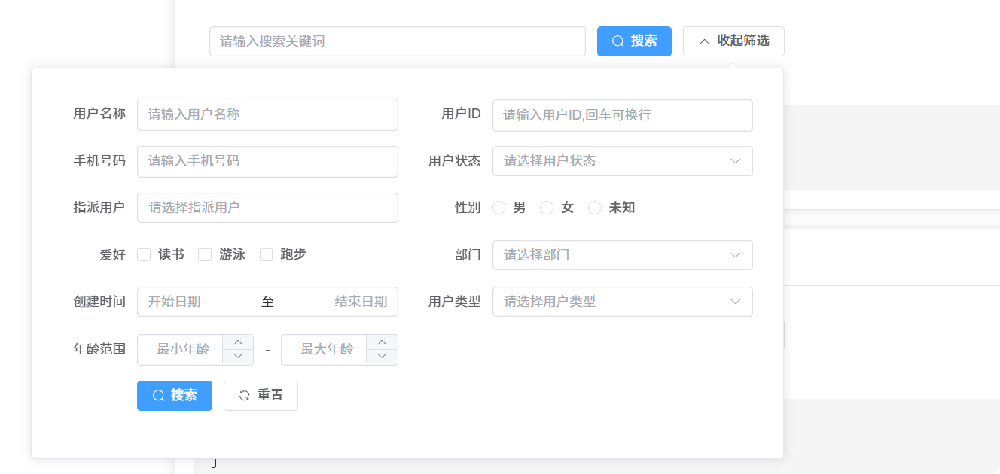
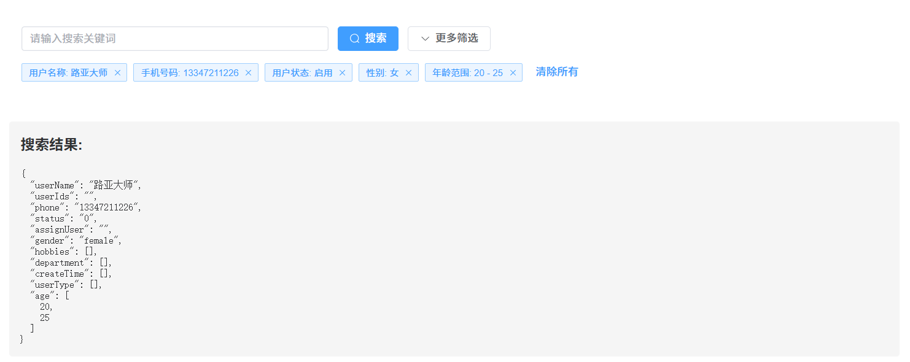

# Element Advanced Search

[](https://www.npmjs.com/package/element-advanced-search)
[](https://vuejs.org/)
[](https://element-plus.org/)
[](https://www.npmjs.com/package/element-advanced-search)
[](https://github.com/wrain/element-advanced-search/stargazers)
[](https://github.com/wrain/element-advanced-search/issues)

[English](README.en.md) | 简体中文

Element Advanced Search 是一个功能强大的 Vue 3 搜索组件，基于 Element Plus 构建，提供了丰富的搜索功能，包括快速搜索、高级筛选、搜索条件缓存、自定义插槽等。本组件及其文档均由通义灵码智能编码助手完成开发与编写，旨在为开发者提供高效、易用的搜索解决方案。[查看功能演示](https://wrain.github.io/element-advanced-search/)


## 组件截图展示

### 基础搜索界面


### 搜索结果界面


## 版本历史

有关每个版本的详细变更，请查看 [更新日志](CHANGELOG.md) | [Changelog](CHANGELOG.en.md)。

## 目录

- [功能特性](#功能特性)
- [依赖说明](#依赖说明)
- [安装与使用](#安装与使用)
- [Props](#props)
- [Events](#events)
- [SearchConfig 配置项](#searchconfig-配置项)
  - [基础配置](#基础配置)
  - [FormItem 配置项](#formitem-配置项)
    - [Input 类型 (type: 'input')](#input-类型-type-input)
    - [Textarea 类型 (type: 'textarea')](#textarea-类型-type-textarea)
    - [Select 类型 (type: 'select')](#select-类型-type-select)
    - [Treeselect 类型 (type: 'treeselect')](#treeselect-类型-type-treeselect)
    - [Radio 类型 (type: 'radio')](#radio-类型-type-radio)
    - [Checkbox 类型 (type: 'checkbox')](#checkbox-类型-type-checkbox)
    - [Date 类型 (type: 'date')](#date-类型-type-date)
    - [Daterange 类型 (type: 'daterange')](#daterange-类型-type-daterange)
    - [Number 类型 (type: 'number')](#number-类型-type-number)
    - [Numberrange 类型 (type: 'numberrange')](#numberrange-类型-type-numberrange)
    - [Custom 类型 (type: 'custom')](#custom-类型-type-custom)
  - [SelectOption 配置项](#selectoption-配置项)
- [Slots](#slots)
  - [自定义表单项插槽](#自定义表单项插槽)
  - [自定义标签显示](#自定义标签显示)
- [使用示例](#使用示例)
  - [基础用法](#基础用法)
  - [带缓存功能](#带缓存功能)
  - [远程搜索](#远程搜索)
- [类型声明使用说明](#类型声明使用说明)
  - [1. 导入 SearchConfig 类型](#1-导入-searchconfig-类型)
  - [2. 主要类型说明](#2-主要类型说明)
  - [3. 在 Vue 项目中使用类型](#3-在-vue-项目中使用类型)
  - [4. 自定义类型扩展](#4-自定义类型扩展)
- [注意事项](#注意事项)
- [浏览器支持](#浏览器支持)
- [许可证](#许可证)

## 功能特性

- 🚀 **快速搜索**：提供简单的关键词搜索功能
- 🎛️ **高级筛选**：支持多种表单控件的复杂筛选条件
- 💾 **搜索条件缓存**：可将搜索条件保存到 localStorage 中
- 🧩 **自定义插槽**：支持完全自定义的表单控件
- 🏷️ **搜索标签显示**：自动显示当前搜索条件的标签
- 📱 **响应式布局**：支持多种屏幕尺寸的自适应显示
- 🌐 **远程数据支持**：支持远程搜索和异步数据加载
- 📝 **多种表单控件**：支持输入框、选择框、日期选择器、数字输入框等多种表单控件

## 依赖说明

本组件依赖以下库：

| 依赖项 | 版本要求 | 说明 |
| --- | --- | --- |
| Vue.js | ^3.2.0 | Vue 3 框架 |
| Element Plus | ^2.0.0 | Element Plus UI 组件库 |
| @element-plus/icons-vue | ^2.0.0 | Element Plus 图标库 |
| Sass/SCSS | ^1.32.0 | 样式预处理器 |

开发依赖：
```json
{
  "vue": "^3.2.0",
  "element-plus": "^2.0.0",
  "@element-plus/icons-vue": "^2.0.0",
  "sass": "^1.32.0"
}
```

## 安装与使用

```bash
# 安装组件
npm install element-advanced-search
```

```vue
<template>
  <ElementAdvancedSearch
    v-model="searchParams"
    :search-config="searchConfig"
    cache-key="user-search"
    quick-search-field="keywords"
    @search="handleSearch"
  />
</template>

<script setup>
import { ref } from 'vue'
import ElementAdvancedSearch from 'element-advanced-search'
import 'element-advanced-search/dist/style.css'

const searchParams = ref({})
const searchConfig = {
  itemsPerRow: 2,
  popoverWidth: 800,
  labelWidth: '100px',
  inline: true,
  formItems: [
    // 表单配置项
  ]
}

const handleSearch = (params) => {
  console.log('搜索参数:', params)
  // 执行搜索逻辑
}
</script>
```

## Props

| 属性名 | 类型 | 默认值 | 说明 |
| --- | --- | --- | --- |
| searchConfig | SearchConfig | 必填 | 搜索配置对象 |
| quickSearchField | string | 'keyword' | 快速搜索字段名 |
| quickSearchPlaceholder | string | '请输入搜索关键词' | 快速搜索占位符 |
| modelValue | Record<string, any> | {} | v-model 绑定值 |
| cacheKey | string | '' | 缓存键名，用于区分不同页面的搜索条件 |

## Events

| 事件名 | 参数 | 说明 |
| --- | --- | --- |
| search | (value: Record<string, any>) | 搜索事件，返回搜索参数 |
| update:modelValue | (value: Record<string, any>) | v-model 更新事件 |

## SearchConfig 配置项

### 基础配置

| 属性名 | 类型 | 默认值 | 说明 |
| --- | --- | --- | --- |
| itemsPerRow | number | 2 | 每行显示的表单项数量 |
| popoverWidth | number | 800 | 高级搜索弹出层宽度 |
| labelWidth | string | '100px' | 表单项标签宽度 |
| inline | boolean | true | 是否使用内联表单布局 |
| formItems | FormItem[] | [] | 表单项配置数组 |

### FormItem 配置项

所有表单项都包含以下基础属性：

| 属性名 | 类型 | 必填 | 说明 |
| --- | --- | --- | --- |
| field | string | 是 | 字段名 |
| label | string | 是 | 标签名 |
| type | string | 否 | 表单控件类型，默认为 'input' |
| default | any | 否 | 默认值 |
| hidden | boolean | 否 | 是否隐藏该表单项 |
| displayValue | Function | 否 | 自定义标签显示函数 |

根据不同类型，还有额外的特定属性：

#### Input 类型 (type: 'input')

文本输入框

| 属性名 | 类型 | 默认值 | 说明 |
| --- | --- | --- | --- |
| placeholder | string | `请输入${label}` | 占位符文本 |
| clearable | boolean | true | 是否可清空 |

#### Textarea 类型 (type: 'textarea')

文本域，支持自动扩展

| 属性名 | 类型 | 默认值 | 说明 |
| --- | --- | --- | --- |
| shortPlaceholder | string | `请输入${label}` | 简短占位符文本 |
| longPlaceholder | string | `请输入${label}` | 详细占位符文本 |
| clearable | boolean | true | 是否可清空 |

#### Select 类型 (type: 'select')

下拉选择框

| 属性名 | 类型 | 默认值 | 说明 |
| --- | --- | --- | --- |
| placeholder | string | `请选择${label}` | 占位符文本 |
| clearable | boolean | true | 是否可清空 |
| multiple | boolean | false | 是否多选 |
| filterable | boolean | false | 是否可过滤 |
| remote | boolean | false | 是否远程搜索 |
| remoteMethod | Function | undefined | 远程搜索方法 |
| loadOptions | Function | undefined | 异步加载选项方法 |
| options | SelectOption[] | [] | 选项列表 |

#### Treeselect 类型 (type: 'treeselect')

树形选择框

| 属性名 | 类型 | 默认值 | 说明 |
| --- | --- | --- | --- |
| placeholder | string | `请选择${label}` | 占位符文本 |
| clearable | boolean | true | 是否可清空 |
| multiple | boolean | false | 是否多选 |
| showCheckbox | boolean | false | 是否显示复选框 |
| maxDropdownHeight | number | 300 | 下拉框最大高度 |
| filterable | boolean | false | 是否可过滤 |
| nodeKey | string | 'value' | 节点键名 |
| props | object | { value: 'value', label: 'label', children: 'children' } | 配置选项 |
| options | SelectOption[] | [] | 选项列表 |
| remote | boolean | false | 是否远程搜索 |
| remoteMethod | Function | undefined | 远程搜索方法 |
| loadOptions | Function | undefined | 异步加载选项方法 |

#### Radio 类型 (type: 'radio')

单选框

| 属性名 | 类型 | 默认值 | 说明 |
| --- | --- | --- | --- |
| options | SelectOption[] | [] | 选项列表 |

#### Checkbox 类型 (type: 'checkbox')

复选框

| 属性名 | 类型 | 默认值 | 说明 |
| --- | --- | --- | --- |
| options | SelectOption[] | [] | 选项列表 |

#### Date 类型 (type: 'date')

日期选择器

| 属性名 | 类型 | 默认值 | 说明 |
| --- | --- | --- | --- |
| placeholder | string | `请选择${label}` | 占位符文本 |
| clearable | boolean | true | 是否可清空 |

#### Daterange 类型 (type: 'daterange')

日期范围选择器

| 属性名 | 类型 | 默认值 | 说明 |
| --- | --- | --- | --- |
| startPlaceholder | string | '开始日期' | 开始日期占位符 |
| endPlaceholder | string | '结束日期' | 结束日期占位符 |
| clearable | boolean | true | 是否可清空 |

#### Number 类型 (type: 'number')

数字输入框

| 属性名 | 类型 | 默认值 | 说明 |
| --- | --- | --- | --- |
| min | number | undefined | 最小值 |
| max | number | undefined | 最大值 |
| placeholder | string | `请输入${label}` | 占位符文本 |
| controlsPosition | string | 'right' | 控制按钮位置 |

#### Numberrange 类型 (type: 'numberrange')

数字范围输入框

| 属性名 | 类型 | 默认值 | 说明 |
| --- | --- | --- | --- |
| min | number | undefined | 最小值 |
| max | number | undefined | 最大值 |
| minPlaceholder | string | '最小值' | 最小值占位符 |
| maxPlaceholder | string | '最大值' | 最大值占位符 |
| controlsPosition | string | 'right' | 控制按钮位置 |

#### Custom 类型 (type: 'custom')

自定义插槽类型

| 属性名 | 类型 | 必填 | 说明 |
| --- | --- | --- | --- |
| slotName | string | 否 | 插槽名称，默认为字段名 |
| displayValue | Function | 否 | 自定义标签显示函数 |

### SelectOption 配置项

| 属性名 | 类型 | 必填 | 说明 |
| --- | --- | --- | --- |
| label | string | 是 | 选项标签 |
| value | any | 是 | 选项值 |
| children | SelectOption[] | 否 | 子选项（用于树形结构） |

## Slots

### 自定义表单项插槽

对于 `type: 'custom'` 的表单项，可以通过指定的插槽名称来自定义表单控件：

```vue
<template>
  <ElementAdvancedSearch
    v-model="searchParams"
    :search-config="searchConfig"
  >
    <template #status="{ model, field }">
      <el-switch
        v-model="model[field]"
        active-text="启用"
        inactive-text="禁用"
      />
    </template>
  </ElementAdvancedSearch>
</template>
```

插槽作用域参数：
- `model`: 表单数据对象
- [field](src\types\index.d.ts#L10-L10): 当前字段名

### 自定义标签显示

对于 `type: 'custom'` 的表单项，可以通过 [displayValue](src\types\index.d.ts#L17-L17) 函数来自定义搜索标签的显示内容：

```js
const searchConfig = {
  formItems: [
    {
      field: 'status',
      label: '状态',
      type: 'custom',
      slotName: 'status',
      default: false,
      displayValue: (value) => {
        return value ? '启用' : '禁用'
      }
    }
  ]
}
```

## 使用示例

### 基础用法

```vue
<template>
  <ElementAdvancedSearch
    v-model="searchParams"
    :search-config="basicSearchConfig"
    @search="handleSearch"
  />
</template>

<script setup>
import { ref } from 'vue'
import ElementAdvancedSearch from 'element-advanced-search'

const searchParams = ref({})

const basicSearchConfig = {
  formItems: [
    {
      field: 'name',
      label: '姓名',
      type: 'input',
      placeholder: '请输入姓名'
    },
    {
      field: 'status',
      label: '状态',
      type: 'select',
      placeholder: '请选择状态',
      options: [
        { label: '启用', value: '0' },
        { label: '禁用', value: '1' }
      ]
    }
  ]
}

const handleSearch = (params) => {
  console.log('搜索参数:', params)
}
</script>
```

### 带缓存功能

```vue
<template>
  <ElementAdvancedSearch
    v-model="searchParams"
    :search-config="cacheSearchConfig"
    cache-key="user-management"
    quick-search-field="keywords"
    @search="handleSearch"
  >
    <template #status="{ model, field }">
      <el-switch
        v-model="model[field]"
        active-text="启用"
        inactive-text="禁用"
      />
    </template>
  </ElementAdvancedSearch>
</template>

<script setup>
import { ref } from 'vue'
import ElementAdvancedSearch from 'element-advanced-search'

const searchParams = ref({})

const cacheSearchConfig = {
  itemsPerRow: 2,
  popoverWidth: 800,
  labelWidth: '100px',
  inline: true,
  formItems: [
    {
      field: 'userName',
      label: '用户名称',
      type: 'input',
      placeholder: '请输入用户名称'
    },
    {
      field: 'status',
      label: '状态',
      type: 'custom',
      slotName: 'status',
      displayValue: (value) => value ? '启用' : '禁用'
    }
  ]
}

const handleSearch = (params) => {
  console.log('搜索参数:', params)
}
</script>
```

### 远程搜索

```js
const remoteSearchConfig = {
  formItems: [
    {
      field: 'assignUser',
      label: '指派用户',
      type: 'select',
      placeholder: '请选择指派用户',
      filterable: true,
      remote: true,
      remoteMethod: async (query) => {
        // 模拟API调用
        const response = await fetch(`/api/users?keyword=${query}`)
        return response.json()
      },
      loadOptions: async () => {
        // 加载默认选项
        const response = await fetch('/api/users')
        return response.json()
      }
    }
  ]
}
```

## 类型声明使用说明

如果您使用的是TypeScript编写项目，本组件提供了完整的 TypeScript 类型支持，您可以通过以下方式使用类型声明：

### 1. 导入 SearchConfig 类型

```typescript
import type { SearchConfig } from 'element-advanced-search'

// 使用示例
const searchConfig: SearchConfig = {
  itemsPerRow: 2,
  popoverWidth: 800,
  labelWidth: '100px',
  inline: true,
  formItems: [
    // 表单配置项
  ]
}
```

### 2. 主要类型说明

本组件导出的主要类型包括：

| 类型名称 | 说明 |
| --- | --- |
| [SearchConfig](src\types\index.d.ts#L115-L125) | 搜索配置对象类型，用于定义搜索表单的整体配置 |
| [FormItem](src\types\index.d.ts#L103-L113) | 表单项配置类型，定义每个表单项的属性 |
| [SelectOption](src\types\index.d.ts#L25-L29) | 选择项配置类型，用于 select、radio 等组件的选项 |

### 3. 在 Vue 项目中使用类型

```vue
<template>
  <ElementAdvancedSearch
    v-model="searchParams"
    :search-config="searchConfig"
    @search="handleSearch"
  />
</template>

<script setup lang="ts">
import { ref } from 'vue'
import ElementAdvancedSearch, { type SearchConfig } from 'element-advanced-search'
import 'element-advanced-search/dist/style.css'

// 定义搜索参数
const searchParams = ref<Record<string, any>>({})

// 定义搜索配置并使用类型声明
const searchConfig: SearchConfig = {
  itemsPerRow: 2,
  popoverWidth: 800,
  labelWidth: '100px',
  inline: true,
  formItems: [
    {
      field: 'name',
      label: '姓名',
      type: 'input',
      placeholder: '请输入姓名'
    },
    {
      field: 'status',
      label: '状态',
      type: 'select',
      placeholder: '请选择状态',
      options: [
        { label: '启用', value: '0' },
        { label: '禁用', value: '1' }
      ]
    }
  ]
}

// 搜索事件处理函数
const handleSearch = (params: Record<string, any>) => {
  console.log('搜索参数:', params)
  // 执行搜索逻辑
}
</script>
```

### 4. 自定义类型扩展

如果需要扩展组件提供的类型，可以使用 TypeScript 的类型合并功能：

```typescript
// 在您的项目中扩展 FormItem 类型
declare module 'element-advanced-search' {
  interface FormItem {
    // 添加自定义属性
    customProperty?: string
  }
}
```

通过以上方式，您可以在项目中充分利用 TypeScript 的类型检查功能，提高开发效率和代码质量。

## 注意事项

1. 使用缓存功能时，确保为每个页面设置唯一的 [cacheKey](src\components\ElementAdvancedSearch\index.vue#L12-L12)
2. 对于自定义插槽，需要提供相应的 [slotName](src\types\index.d.ts#L104-L104) 并在模板中定义对应插槽
3. 自定义插槽的搜索标签显示可以通过 [displayValue](src\types\index.d.ts#L17-L17) 函数进行自定义
4. 所有表单项都应设置合适的默认值，以确保表单行为的一致性
5. 远程搜索功能需要提供 [remoteMethod](src\types\index.d.ts#L41-L41) 和 [loadOptions](src\types\index.d.ts#L44-L44) 方法来处理数据加载
6. 组件会自动处理表单数据的响应式更新和搜索标签的显示
7. 组件支持多种表单控件类型，包括输入框、选择框、日期选择器、数字输入框等
8. 数字范围和日期范围类型的值以数组形式存储和传递

## 浏览器支持

- 现代浏览器 (Chrome, Firefox, Safari, Edge)

## 许可证

MIT
```